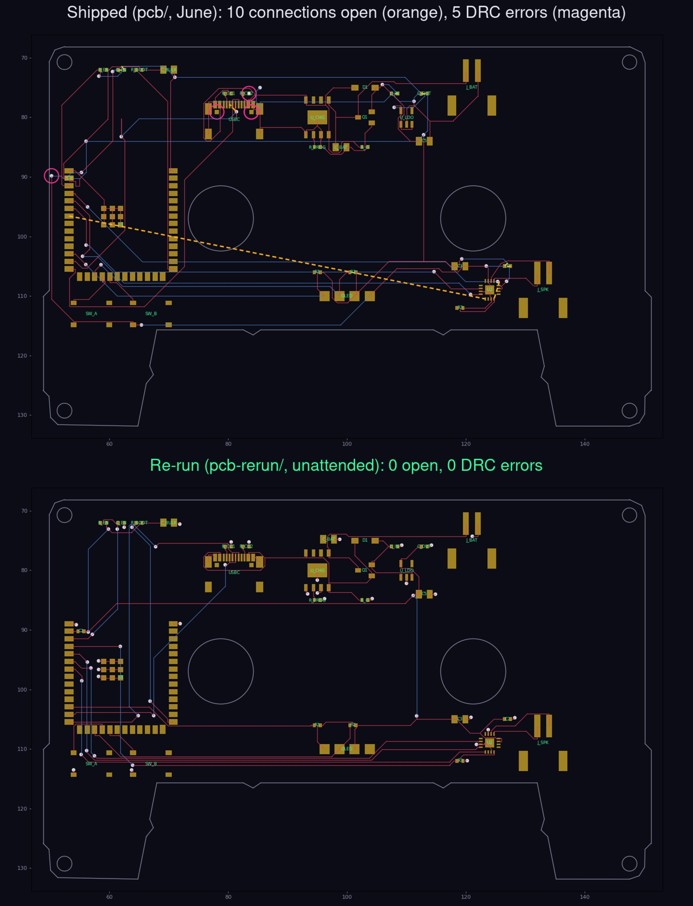

# pcb-rerun — flexisette re-driven unattended (2026-10-04)

A side-by-side re-run of the PCB next to the shipped board in [`../pcb`](../pcb). Same circuit and
same floorplan, routed with nobody touching KiCad, using the current
[circuit-skills](https://github.com/punkfab/circuit-skills) tooling.



## Result

| | Shipped (`../pcb`, June) | Re-run (this folder) |
|---|---|---|
| Open connections | 10 | **0** |
| Shorts | 0 | 0 |
| DRC errors (JLCPCB rules) | 5 (3 hole clearance, 1 edge clearance, 1 drill) | **0** |
| SMD pads not reached on their own layer | 4 | **0** |
| Vias | 26 | 47 |
| Track length | 1263 mm | 1000 mm |
| Ground carried as track instead of pour | 350 mm | 44 mm |
| Route time | hours of iteration, then a ~10-net tail left for hand-finishing | 6 s |

Checks on the re-run board:

- KiCad DRC at every severity: 0 errors, 0 unconnected, 5 silkscreen warnings.
- `dfm_check` (hole spacing, via drill and annular ring) passes.
- `check_floating` passes for all 106 SMD pads.
- The netlist is identical to the shipped board's: 22 nets, the same pads on each.

It has not been through JLCPCB's online DFM or a human review. Do both before ordering.

## What changed

**The route starts from the placed KiCad board, not from tscircuit's DSN export.** `scripts/route2.sh`
exports the placement, strips tscircuit's own routing, adds the bottom ground pour, applies JLCPCB
rules, and then runs every router on the KiCad board itself and scores them
(`scripts/route_eval.py`). Freerouting goes through KiCad's own Specctra export and import. The pour
goes out as a plane and the tape window, reel holes and screw holes go out as keepouts, so the router
sees the real board. This also closes roadmap gap #1 ("round-trip placement doesn't reach the routing
DSN"): there is no second copy of the placement to drift.

**Three placement changes**, each named by the tooling and made in the design source:

| Part | Change | Why |
|---|---|---|
| `SW_A`, `SW_B` | up 0.5 mm | A button pad was 0.455 mm from the head-notch edge. |
| `C1` (ESP32 3V3 decoupling, bottom side) | 2 mm inboard, under the module | Directly under the pin it sat against the board edge, and one bottom track boxed its ground pad off from the pour. |
| `C_BAT` | moved to the charger's BAT pin, placed by pin (`Decap`) | It was on the far side of the charger, 5 mm of crowded routing from the pin it decouples. Freerouting left that connection open. |

**Four tooling fixes** this board forced, all now in circuit-skills:

- **Ref-less footprints.** KiCad silently refuses to export a board that has a footprint with an empty reference. tscircuit exports bare holes and vias that way, which is why Freerouting-on-the-KiCad-board had never worked on a tscircuit design.
- **Keepout margin.** Cutout keepouts are grown by the copper-to-edge clearance. Otherwise a track ran 0.14 mm from the tape window.
- **Pour connection.** The pour connects SMD pads solidly, with thermal reliefs on through-hole pads only.
- **Capacity autorouter outline.** `route_srj` now gives the router the real outline polygon and the cutouts. It used to see only the bounding box.

The capacity autorouter's candidate also connects everything with no shorts, but leaves 14 clearance
violations (`results/candidate-srj.kicad_pcb`). Freerouting's is the one kept.

## Reproduce

```bash
cd pcb-rerun
npm install                 # or: ln -s ../pcb/node_modules node_modules
bash scripts/route2.sh      # ~30 s: export -> gates -> prep -> route with every backend -> apply the best -> DRC
```

Needs bun/tsci, KiCad 9 (`kicad-cli` and the system python `pcbnew` module), and Freerouting 2.2.4
(`freert224`). No running KiCad is required.

## results/

| file | what |
|---|---|
| `compare.jpg` | shipped vs re-run, with open connections and DRC errors marked |
| `route-eval-summary.md` | the scored table for both routers and the diagnosis |
| `candidate-srj.kicad_pcb` | the capacity autorouter's candidate |
| `placement-heat.svg` | congestion map of the placement before routing |
